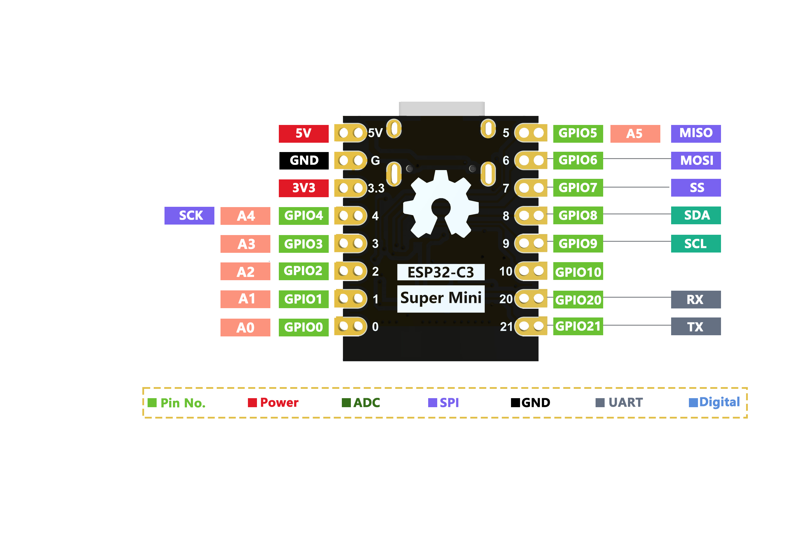
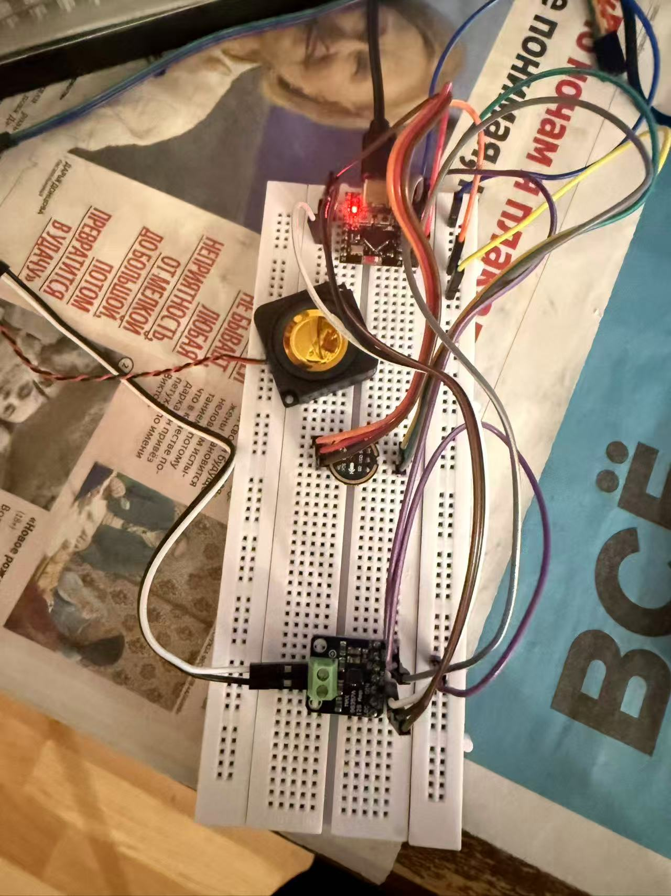

# ESP32-C3 SuperMini 录音回放项目
基于ESP32-C3supermini + INMP441(I2S麦克风) + MAX98357A(I2S功放)
功能：按住板载BOOT按键录音，松开按键自动回放录音，最长录制3秒。

## 硬件清单
1. ESP32-C3 SuperMini开发板
2. INMP441 麦克风模块
3. MAX98357A I2S数字功放模块
4. 扬声器（喇叭）
5. 杜邦线若干

## 引脚接线表
### INMP441 麦克风
| ESP32-C3 GPIO | INMP441引脚 | 说明 |
| ---- | ---- | ---- |
| GPIO5 | SCK | I2S位时钟 BCLK |
| GPIO1 | WS | 声道时钟 |
| GPIO0 | DOUT(SD) | 麦克风音频数据输出 |
| 3V3 | VDD | 供电 |
| GND | GND | 共地 |

### MAX98357A 功放
| ESP32-C3 GPIO | MAX98357A引脚 | 说明 |
| ---- | ---- | ---- |
| GPIO8 | BCLK | I2S位时钟 |
| GPIO7 | LRC(WS) | 声道时钟 |
| GPIO10 | DIN | I2S音频数据输入 |
| 3V3 | VIN | 功放供电 |
| GND | GND | 共地 |
| 3.3V| SD |-|；
| - | GAIN 悬空|默认音量|；
| - | OUT+ / OUT- | 接喇叭两根线 |

## ESP32supermini图

## 硬件接线示意图

### 按键
板载BOOT按键 → GPIO9，录音触发按键，**无需额外外接按键**

## 软件环境
- PlatformIO
- Linux系统
- Framework: Arduino for ESP32
- 串口波特率：115200

## 代码逻辑说明
1. 采用I2S分时复用（ESP32C3只有1组I2S硬件），同一时间只能工作在麦克风采集 或 功放播放模式。
2. 按住BOOT按键：启动I2S接收模式，采集麦克风音频存入内存数组。
3. 松开BOOT按键：停止录音，自动切换I2S为发送模式，播放缓存内录音。
4. 最大录音时长：3秒，到达上限自动停止录音并回放。
5. 录音数据保存在芯片RAM。

## 使用操作步骤
1. 按照接线表接好所有模块，所有器件GND必须共地。
2. PlatformIO编译并上传固件到ESP32-C3。
3. 打开串口监视器（波特率115200），上电，串口打印 `就绪，按住BOOT按键录音，松开自动播放`。
4. **按住BOOT按键不放**开始录音，对着麦克风说话。
5. **松开BOOT按键**，自动播放刚刚录制的声音。
6. 录音最长3秒，满3秒自动停止并回放。

## 限制
1. ESP32-C3只有1路硬件I2S，所以必须分时切换录/放，**不能边录边听**。
2. 音频数据存在内存，断电录音全部丢失。
3. 最长固定3秒录音。
